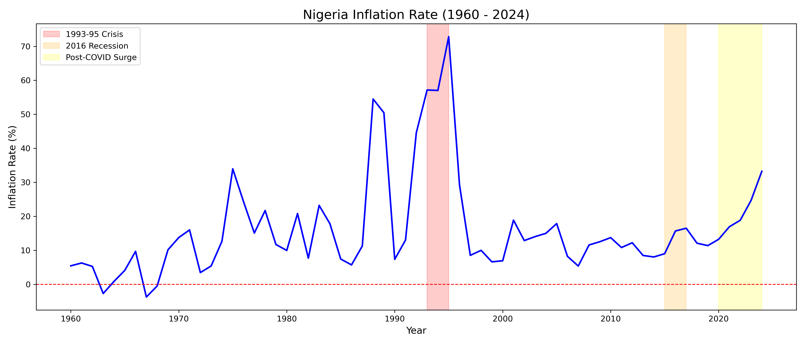

# Nigeria Inflation & Cost of Living Analysis (1960–2024)

An analysis of Nigeria's inflation rate over six decades using World Bank data, 
examining how major economic and political shocks have shaped the cost of living.

As someone who runs a retail business in Nigeria, I wanted to understand how these 
inflation swings compare historically — pricing and stocking decisions today are 
shaped by exactly this kind of volatility, and this project helped me see how far 
back that pattern actually goes.

## Key Findings
- Inflation has been highly volatile rather than steadily rising — swinging between 
  near-zero and peaks above 70% at different points since 1960
- **1995 recorded the highest inflation rate in the dataset at 72.8%**, the peak of 
  a sustained crisis period — four of the five worst years on record (1988, 1989, 
  1993, 1994, 1995) cluster in this single decade, showing the 1993–95 crisis was 
  the climax of a longer economic buildup, not an isolated shock
- A second major spike appears in the mid-1970s (~34%), followed by two decades 
  of relative moderation through the 2000s
- Inflation has trended upward again since 2020, accelerating through the 
  post-COVID period and approaching 30% by 2024
- The 2016 recession shows a more moderate but still visible bump compared to 
  the 1990s and post-2020 periods

## Data
Source: World Bank World Development Indicators (`API_NGA_DS2_en_csv_v2_279569.csv`), 
filtered to Nigeria's annual inflation rate, 1960–2024.

## Chart

*Shaded regions mark three major periods: the 1993–95 crisis, the 2016 recession, 
and the post-COVID surge (2020–2024).*

## Tools
Python · pandas · matplotlib · Jupyter Notebook

## How to Run
1. Clone this repo
2. Open `nigeria-inflation-analysis.ipynb` in Jupyter
3. Run all cells — cleaned data is included in `nigeria_inflation_clean.csv`
